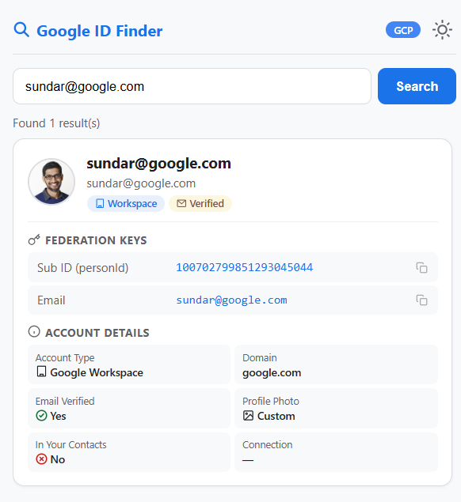

# Google ID Finder

Chrome extension to search Google users and retrieve their unique GAIA ID (Google Account ID) via the internal People API v2.




## Features

- 🔍 Search by email, name
- 🆔 Get GAIA ID (unique Google Account identifier) for any Google user
- 📋 Click-to-copy on all fields
- 🏷️ Auto-detects account type (Personal Gmail / Google Workspace)
- 👤 Shows profile photo, email verification status, contact status
- 🔗 Displays identity sources (PROFILE, CONTACT containers)
- 🌙 Dark mode with persistent toggle
- ⚡ Live search with 500ms debounce

## Installation

1. Clone this repo:
   ```bash
   git clone https://github.com/Paresh-Maheshwari/google-id-finder.git
   ```

2. Open Chrome and go to `chrome://extensions/`

3. Enable **Developer mode** (top right toggle)

4. Click **Load unpacked** and select the cloned folder

5. Open [Google Cloud Console](https://console.cloud.google.com) in a tab and make sure you're logged in

6. Click the extension icon and start searching

## Usage

1. Open `console.cloud.google.com` in any tab (must be logged in)
2. Click the Google ID Finder extension icon
3. Type an email, name in the search box
4. Results appear with:
   - **GAIA ID** — the unique Google Account identifier (used for federation, API calls, etc.)
   - **Account type** — Personal Gmail or Google Workspace
   - **Profile photo** — custom or default
   - **Identity sources** — PROFILE and CONTACT container IDs

## User Card Fields

| Field | Description |
|-------|-------------|
| Sub ID (personId) | GAIA ID — unique numeric Google Account identifier |
| Account Type | Personal Gmail or Google Workspace |
| Domain | Email domain (gmail.com, workspace domain, etc.) |
| Email Verified | Whether the email is verified |
| Profile Photo | Custom photo or default monogram |
| In Your Contacts | Whether the user is in your Google Contacts |
| Connection | Direct social connection status |
| Identity Sources | Container types and IDs (PROFILE, CONTACT) |

## Requirements

- Google Chrome (Manifest V3)
- Active Google account logged into Cloud Console
- `console.cloud.google.com` open in the active tab

## Limitations

- Only searches users you've interacted with or are in your contacts (Google's autocomplete scope)
- Max 10 results per search
- Requires Cloud Console tab open for cookie auth
- Cannot search by phone number (blocked by Google)
- Stranger profiles only expose: photo, metadata, timestamps (no name/email unless in contacts)

## License

This project is licensed under the [MIT License](LICENSE).
